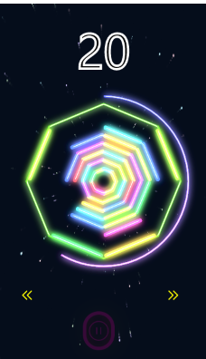

# Yetris
## play it!
https://xiaoyang5381.github.io/Yetris/

## motivation
It is only a repo for show my free game at git page.
I post it for show my tech about react-eco.
It is absolutely based on **completely pure** react-eco,
I dev it based on only
- react
- react-redux
- redux
- redux/toolkit

If you are interest for source code, contact via email: xiaoyang5381@outlook.com.

## difficulty of dev
1. performance problem
   - All game objects are actually dom or svg, under visual effect it will cause performance defect.
   It took me too much time to consider how to optimize it.
   - There are two perf defects
     1. visual effect given by svg is not such stable, 
     2. too much composite paint

   - I solve the two above problems by
     1. employ a new render sequence of svg filter, 
        to make it render as necessarily much as game objects possible in one pass
     
     2. employ `willChange` field for appropriate objects.

2. To absolutely employ react-eco you get a predicable state, but hard to code.
   1. how to process side-effect logic in reducer?

   2. weird behavior of react-hook due to the fiber which mimic stack full coroutine scheduler incompletely.
